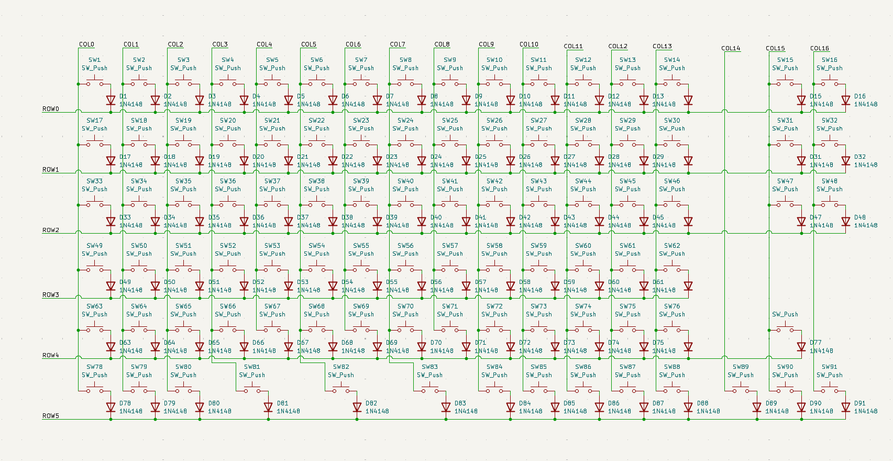
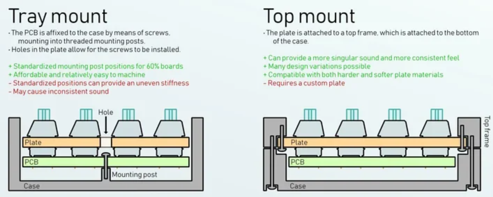
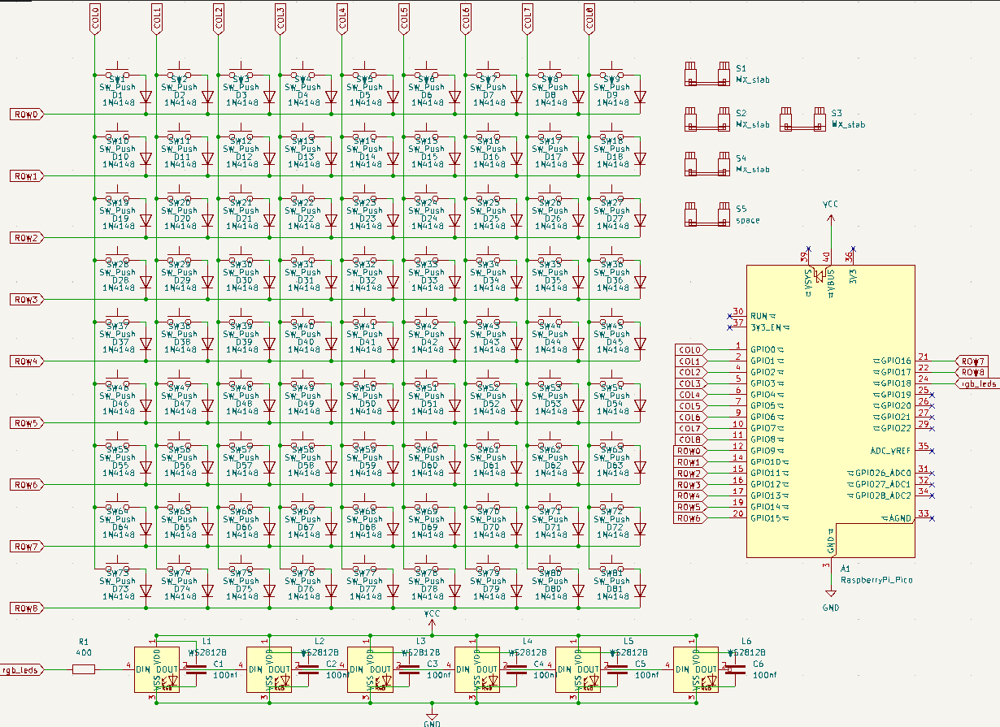
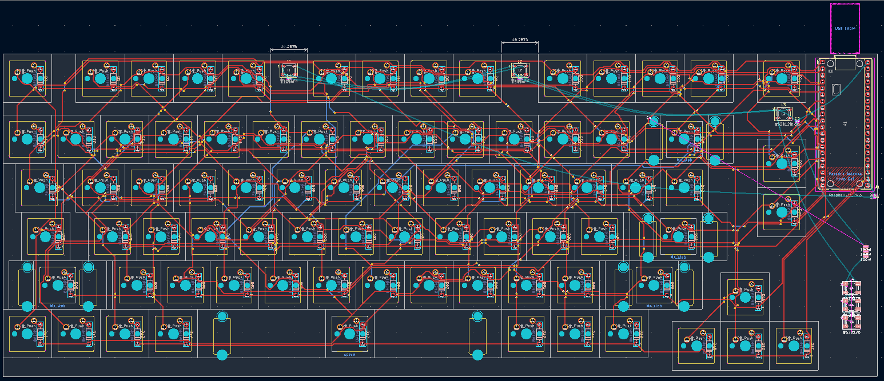

# July 25-27: Schematic finished and PCB WIP
For my week 2 ship, I finished a draft schematic and am partially done with the pcb design. I'm planning to go with a tray mount (see below). I chose to go with a 10x10 matrix of keys and a standard 75% keyboard layout with function keys, arrow keys, 3 custom keys and the normal setup. Originally, i had the matrix like a keyboard but i realized that that was really inefficient (see below). so i changed to a 10x10 matrix. I also had the idea from the start to add leds that diffuse throughout the case. i should still be able to do oled because of the large space under the RPP.

Approximate bom at this moment is below.

I also read more about different mounting styles and realized that a top mount is more effective than a tray mount, so I may switch to that. Luckily I'm not CADding the case at the moment, or I'd be changing my mind way too fast.

| item | amount | possible cost |
|---|---|---|
| pcb grant | 1 | ~$20 to $70, havent gotten a quote yet since pcb isnt done |
| case (from printing legion) | 1 | $0 |
| screws and inserts | ~6 | ~$10 |
| switches | 100 | $44 [link](https://www.keychron.com/products/cherry-switch-set?variant=40136562278489) |
| 1n4148 diodes | 100 | $6 [link](https://www.amazon.com/120Pcs-Rectifier-100Volt-Electronic-Silicon/dp/B0DN62QFYS/ref=sr_1_1_sspa?sr=8-1-spons&sp_csd=d2lkZ2V0TmFtZT1zcF9hdGY) |
| 100nf capacitors | 6 | $0.1 [link](https://jlcpcb.com/partdetail/31683-0603B104K500NT/C30926) |
| 400 ohm resistor | 1 | $0, using own tht |
| leds | 6 | $5 [link](https://www.sparkfun.com/ws2812b-5050-5x5mm-smd-addressable-rgb-led-cut-tape.html) |
| raspberry pi pico | 1 | $0, using own |
| **total** | | $85 to $135 |

[Lapse 1](https://lapse.hackclub.com/timelapse/mLjddo3TH1-p)

[Lapse 2](https://lapse.hackclub.com/timelapse/ptN9FnOOkcLp)

[Lapse 3](https://lapse.hackclub.com/timelapse/w_9JQmZT2n9)

[Lapse 4](https://lapse.hackclub.com/timelapse/ZhsM7e9E6hZI)

**Total time spent: 4.4 hours**: 

